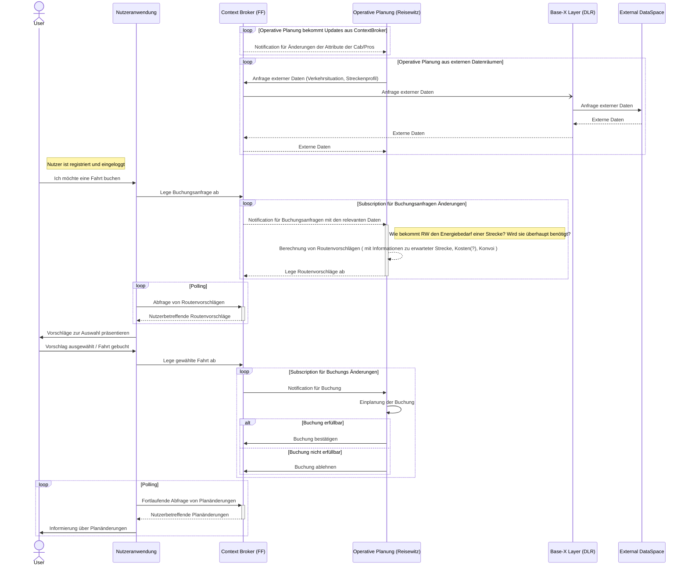

# documentation

## Buchungsanfrage

```mermaid
sequenceDiagram
%% auskommentieren wenn wir Details zur Kommunikation aufschreiben
%% autonumber
%% Benutzer definieren
actor User
%% technische Teilnehmer/Componenten definieren
participant App as Nutzeranwendung
participant CB as Context Broker (FF)
participant RW as Operative Planung (Reisewitz)
participant BX as Base-X Layer (DLR)
participant EXDS as External DataSpace

loop Operative Planung bekommt Updates aus ContextBroker
CB-->>RW: Notification für Änderungen der Attribute der Cab/Pros
end

loop Operative Planung aus externen Datenräumen

RW->>CB:Anfrage externer Daten (Verkehrsituation, Streckenprofil)
CB-)BX:Anfrage externer Daten 
BX->>EXDS: Anfrage externer Daten 
EXDS-->>BX: Externe Daten 
BX-->>CB: Externe Daten 
CB-->>RW: Externe Daten 
end

Note right of User: Nutzer ist registriert und eingeloggt
User->>App: Ich möchte eine Fahrt buchen
App->>CB: Lege Buchungsanfrage ab
loop Subscription für Buchungsanfragen Änderungen
CB-->>RW: Notification für Buchungsanfragen mit den relevanten Daten

activate RW
Note right of RW: Wie bekommt RW den Energiebedarf einer Strecke? Wird sie überhaupt benötigt?
RW-->>RW: Berechnung von Routenvorschlägen ( mit Informationen zu erwarteter Strecke, Kosten(?), Konvoi )
%% Abfrage von Streckenprofil in gegebenem Bereich -> Abgleich des ermittelten Energiebedarfs/Zielzeit

RW-->>CB: Lege Routenvorschläge ab
deactivate RW
end

loop Polling
App->>+CB: Abfrage von Routenvorschlägen
CB-->>-App: Nutzerbetreffende Routenvorschläge
end

App->>User: Vorschläge zur Auswahl präsentieren
User->>App: Vorschlag ausgewählt / Fahrt gebucht
App->>CB: Lege gewählte Fahrt ab

loop Subscription für Buchungs Änderungen
CB->>RW: Notification für Buchung
RW->>RW: Einplanung der Buchung
    alt Buchung erfüllbar
            RW->>CB:  Buchung bestätigen
    else Buchung nicht erfüllbar
            RW->>CB:  Buchung ablehnen
    end
end

loop Polling
App->>+CB: Fortlaufende Abfrage von Planänderungen
CB-->>-App: Nutzerbetreffende Planänderungen
App->>User: Informierung über Planänderungen
end
```
