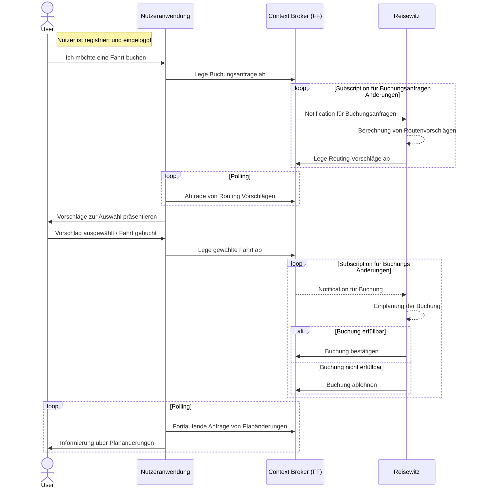

# documentation

## Buchungsanfrage

```mermaid
sequenceDiagram
%% auskommentieren wenn wir Details zur Kommunikation aufschreiben
%% autonumber
%% Benutzer definieren
actor User
%% technische Teilnehmer/Componenten definieren
participant App as Nutzeranwendung
participant CB as Context Broker (FF)
participant RW as Reisewitz

Note right of User: Nutzer ist registriert und eingeloggt
User->>App: Ich möchte eine Fahrt buchen
App->>CB: Lege Buchungsanfrage ab
loop Subscription für Buchungsanfragen Änderungen
CB-->>RW: Notification für Buchungsanfragen
RW-->>RW: Berechnung von Routenvorschlägen
RW->>CB: Lege Routing Vorschläge ab
end

loop Polling
App->>CB: Abfrage von Routing Vorschlägen 
end

App->>User: Vorschläge zur Auswahl präsentieren
User->>App: Vorschlag ausgewählt / Fahrt gebucht
App->>CB: Lege gewählte Fahrt ab

loop Subscription für Buchungs Änderungen
CB-->>RW: Notification für Buchung
RW-->>RW: Einplanung der Buchung
    alt Buchung erfüllbar
            RW->>CB:  Buchung bestätigen
    else Buchung nicht erfüllbar
            RW->>CB:  Buchung ablehnen
    end
end

loop Polling
App->>CB: Fortlaufende Abfrage von Planänderungen
App->>User: Informierung über Planänderungen
end
```
