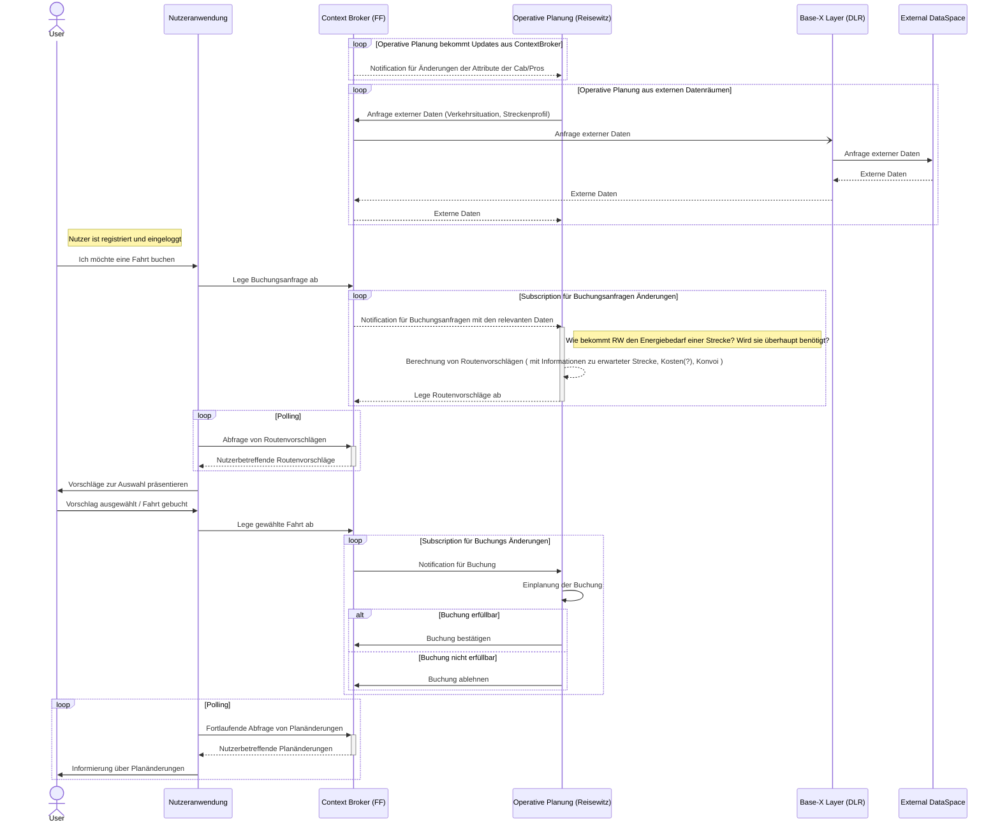
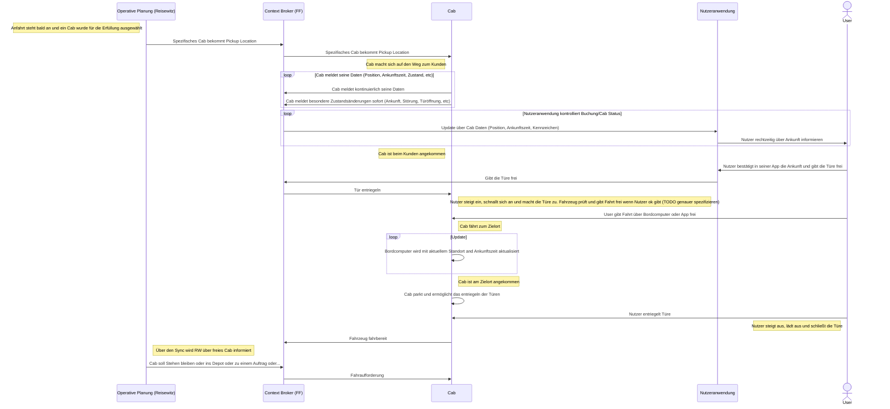
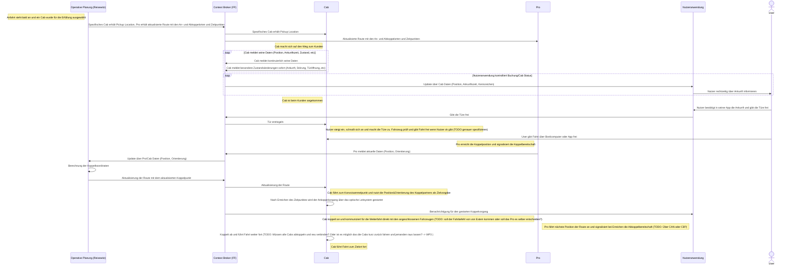

# documentation

## Gesamtsystem
### Buchungsanfrage

### Fahrtantritt&Fahrt ( Ohne Konvoi )

### FF: Konvoifahrt (An- und Abkoppeln)

### FF: Nutzerregistrierung

### FF: Nutzerpräferenzen erfassen und bearbeiten

### FF: Fahrt Bezahlvorgang

### FF: Fahrt Bewertung

### RW (neu): Fahrtaufträge verwalten und optimieren

### RW: Sonderfahrtaufträge abwickeln (Laden, Reparatur, Parken, Fehler/Störungen…) 

### RW: Fahrtausfälle für den Nutzer alternativ lösen

### DLR: Daten aus Mobility Dataspaces anfordern

## Betreiber + Monitoring / Dashboards

### SICP: Flottenplanung mit Szenarien ermöglichen und durchführen

### SICP (neu): Portfolio festlegen

### SICP: Optimierungs- und Szenarienparameter erfassen und bearbeiten

### FF - Dashboarding (neu): Betriebsdaten (operativ und wirtschaftlich) darstellen, monitoren (alerten), analysieren und reporten

### FF - Dashboarding (neu): Information zu Wartungsplänen bereitstellen

### FF - Dashboarding (neu): Fehler/Störungen darstellen und analysieren

### FF - Dashboarding (neu): Sonderfahrtaufträge darstellen und analysieren

### FF - Dashboarding (neu): Fahrtenhistorie darstellen und analysieren

### FF - Dashboarding (neu): Flottenkennzahlen darstellen und analysieren

### FF - Dashboarding (neu): Flottenzustand darstellen und analysieren
