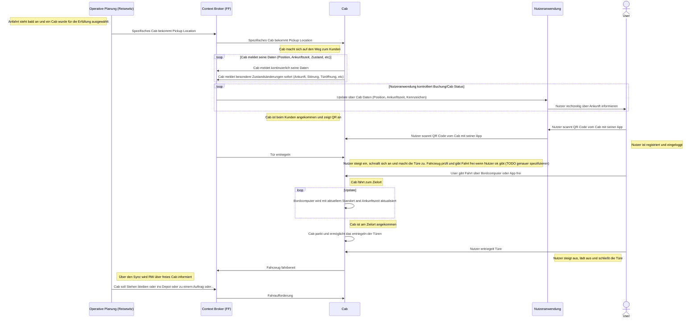

# documentation

## Gesamtsystem
### Buchungsanfrage

### Fahrtantritt&Fahrt ( Ohne Konvoi )

### Konvoifahrt (An- und Abkoppeln)

### Nutzerregistrierung

### Nutzerpräferenzen erfassen und bearbeiten

### Fahrt Bezahlvorgang

### Fahrt Bewertung

### Sonderfahrtaufträge abwickeln (Laden, Reparatur, Parken, Fehler/Störungen…) 

### Fahrtausfälle für den Nutzer alternativ lösen

### Daten aus Mobility Dataspaces anfordern

## Monitoring / Dashboards

### Betriebsdaten (operativ und wirtschaftlich) monitoren, analysieren und reporten

## Betreiber
### Flottenplanung mit Szenarien ermöglichen und durchführen

### Optimierungs- und Szenarienparameter erfassen und bearbeiten

### Fahrtaufträge verwalten und optimieren

### Fehler/Störungen verwalten

### Sonderfahrtaufträge verwalten

### Fahrtenhistorie verwalten und analysieren

### Flottenkennzahlen bereitstelle und analysieren

### Flottenzustand verwalten und analysieren

### Wartungspläne bereitstellen

