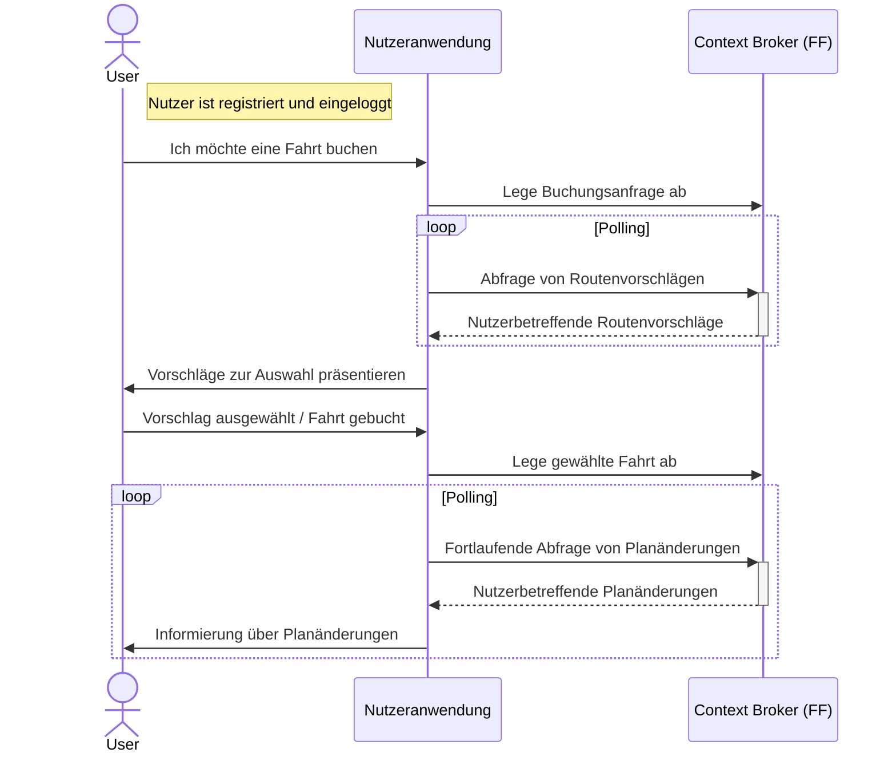
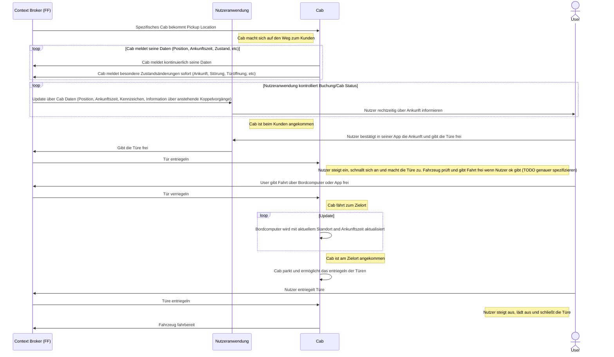
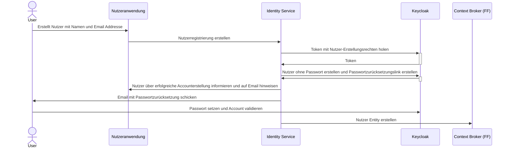
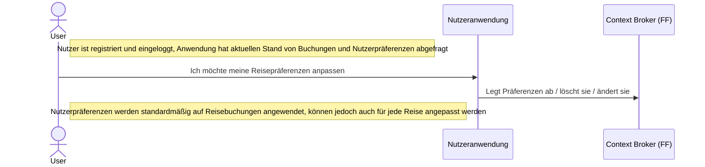
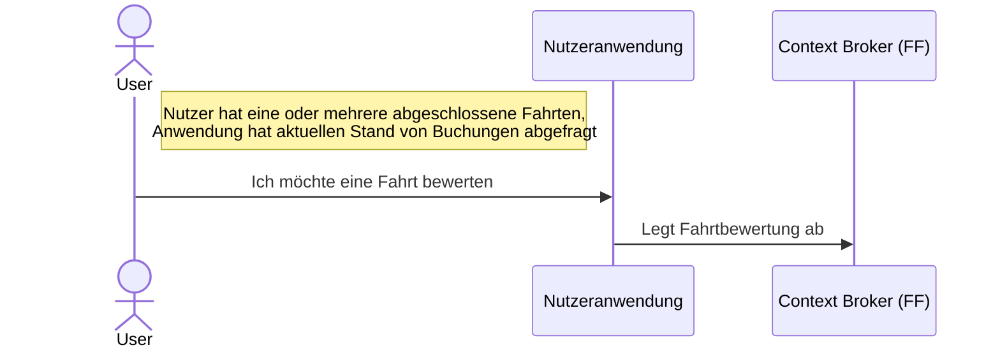

# Reduzierte Sequenzdiagramme der Nutzeranwendung

## Gesamtsystem
### Buchungsanfrage

### Fahrtantritt&Fahrt

### Nutzerregistrierung

> TODO: Welche Registrierungen wollen wir unterstützen? Email&Password vs SSO

### Nutzerpräferenzen erfassen und bearbeiten

### Fahrt Bewertung

